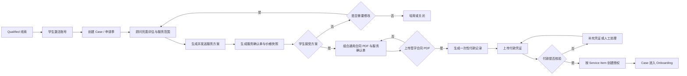
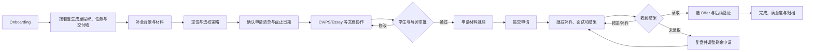
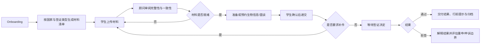

# 际联 SaaS 业务流程

可编辑版本：[FigJam 业务流程图](https://www.figma.com/board/1oi07jE1XXaDgxDqXJnHgS)

## 1. 学生首次咨询流程

```mermaid
flowchart LR
    visitor["访客浏览官网内容"] --> cta["点击免费评估"]
    cta --> profile["提交精简背景与隐私同意"]
    profile --> duplicate{"是否存在有效预约"}
    duplicate -->|"是"| manage["查看或改期现有预约"]
    duplicate -->|"否"| match["按服务类型匹配导师"]
    match --> calendar["读取导师可用时间"]
    calendar --> slot["学生选择时段"]
    slot --> reserve{"数据库占位是否成功"}
    reserve -->|"冲突"| calendar
    reserve -->|"成功"| account["创建待激活账号并发送激活邮件"]
    account --> meetingChoice{"会议链接方式"}
    meetingChoice -->|"自动"| meeting["创建腾讯会议"]
    meetingChoice -->|"手动"| manualMeeting["导师补充会议链接"]
    manualMeeting --> email["发送双方确认和提醒"]
    meeting --> email["发送双方确认和提醒"]
    email --> consult["进行 30 分钟初评（占用 45 分钟）"]
    consult --> qualify{"顾问资格评估"}
    qualify -->|"适合签约"| interest["学生表达签约兴趣"]
    interest --> contractPreview["解锁合同预览与 60 分钟答疑"]
    contractPreview --> proposal["进入服务方案流程"]
    qualify -->|"暂未成熟"| nurture["进入培育与跟进"]
    qualify -->|"不适合"| close["关闭线索并记录原因"]
```

## 2. 签约与付款流程

## 3. 留学服务交付流程

## 4. 签证服务交付流程

## 5. 关键状态责任

| 状态变化 | 发起角色 | 必填信息 |
|---|---|---|
| CONSULTED | 导师 | 咨询摘要、适配度、下一步 |
| QUALIFIED | 导师/管理员 | 推荐服务、预算/时间匹配 |
| PROPOSAL_SENT | 导师/销售 | 方案版本、价格、有效期 |
| CONTRACT_SIGNED | 学生与公司 | 合同快照、签署证据 |
| PAYMENT_VERIFIED | 财务/管理员 | 金额、时间、凭证、核验人 |
| ACTIVE | 系统 | 有效合同、满足付款条件、服务授权 |
| SUBMITTED | 导师/服务人员 | 递交时间、凭证、申请项 |
| COMPLETED | 管理员/负责人 | 交付检查、结果归档、满意度 |
